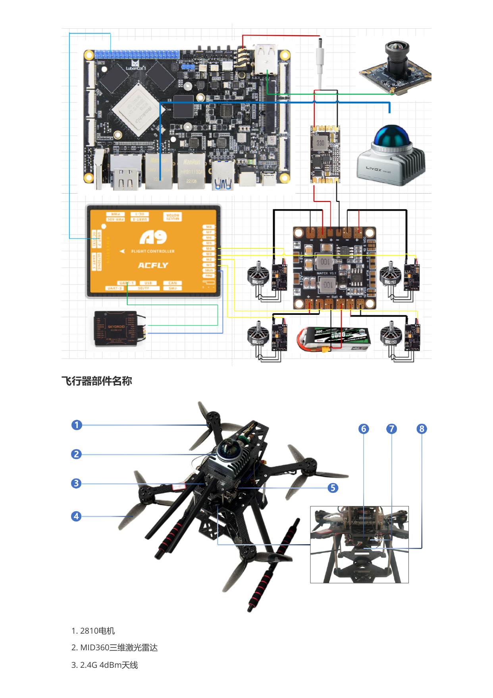
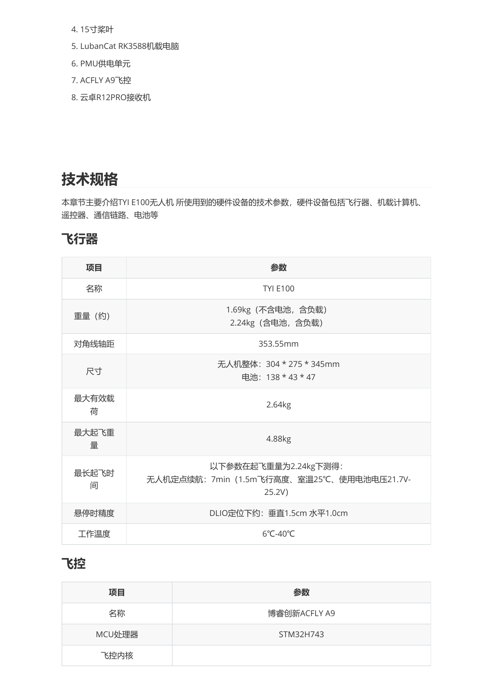
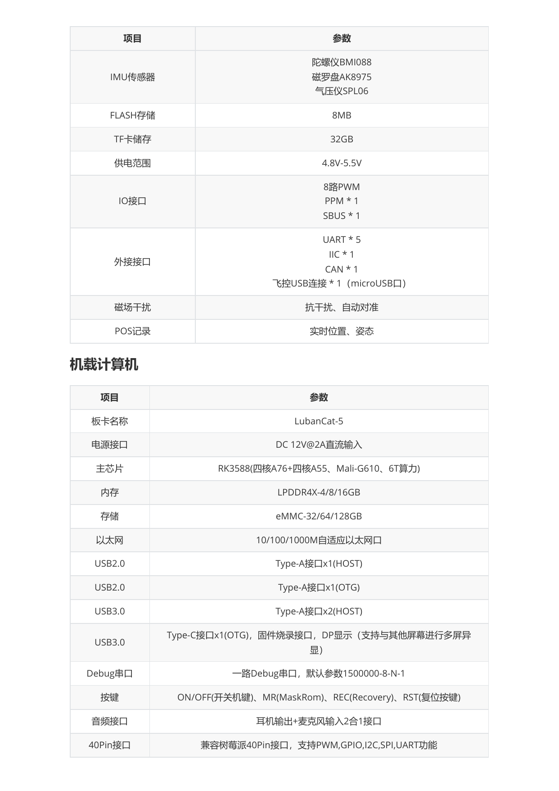
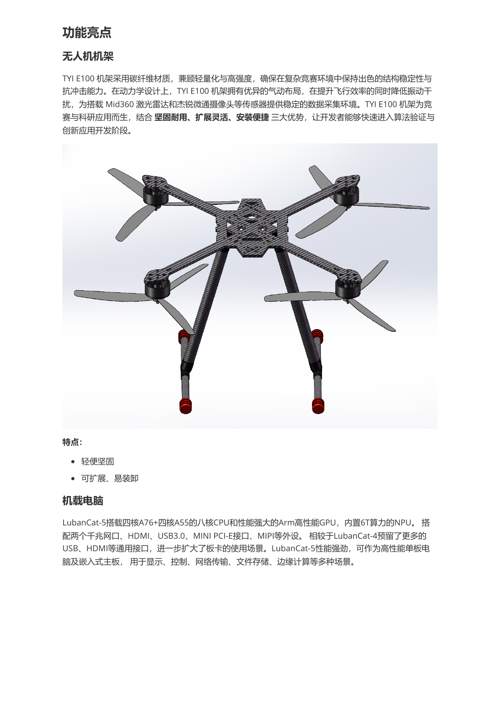
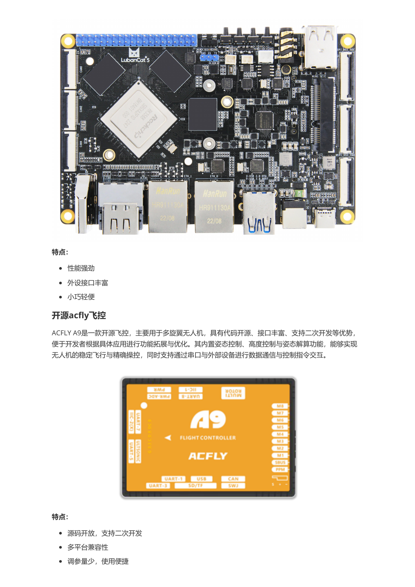
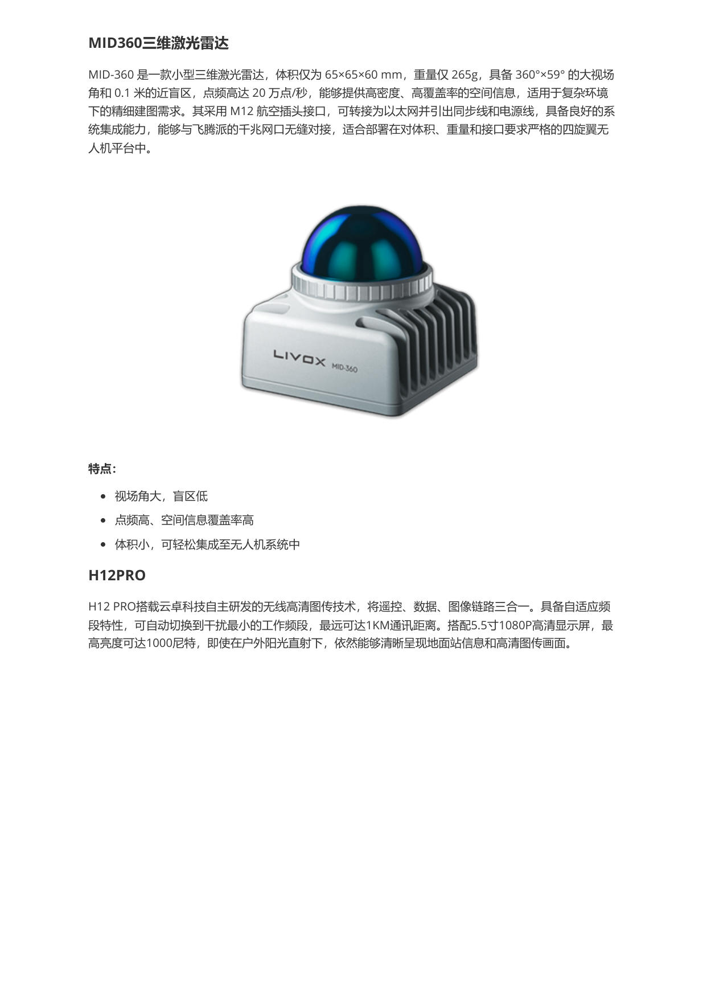
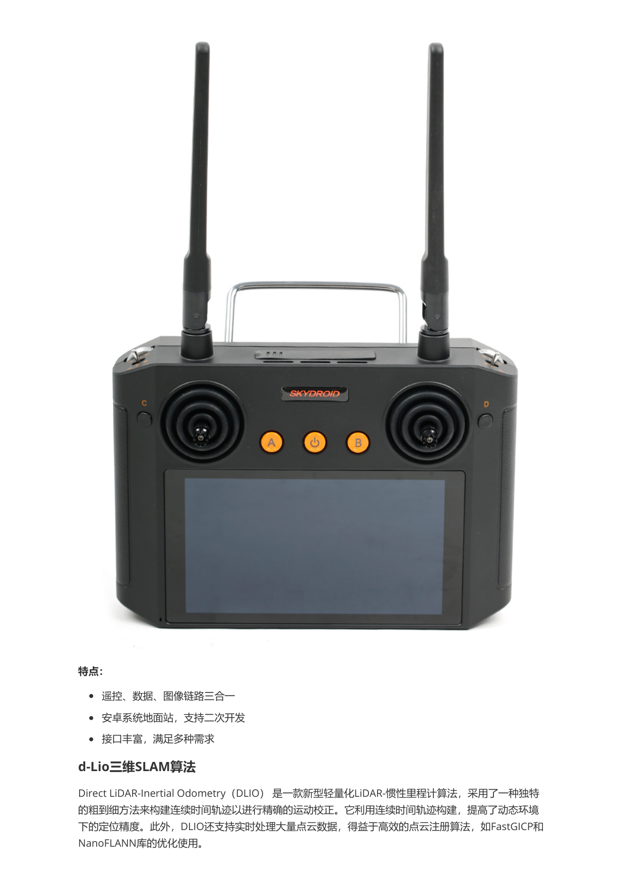
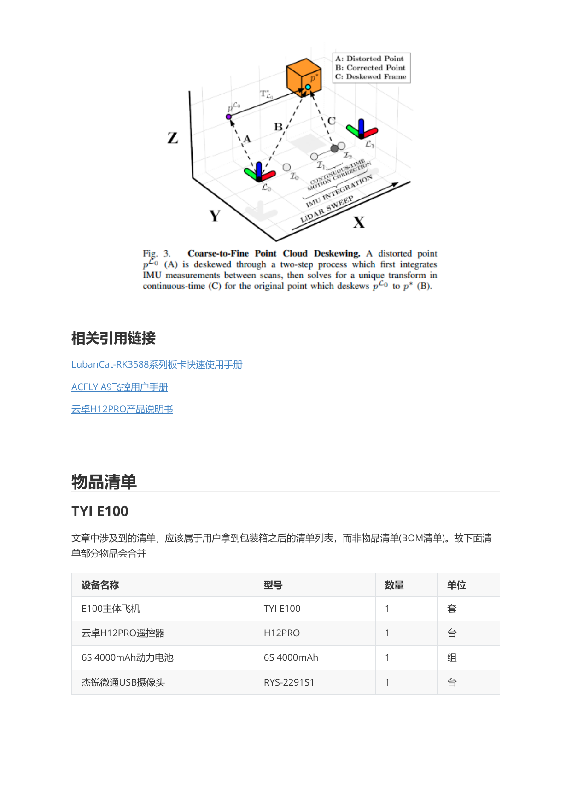

# TYI E100 硬件概览

本文根据《TYI E100 无人机使用手册》整理，聚焦开箱配件与核心硬件能力，方便在文档站中快速查阅。

## 硬件总览

下图整理自手册中的硬件接线图与部件名称页，可作为阅读后续章节前的整体参考。

## 物品清单

手册中的“物品清单”描述的是用户开箱后可核对的配件列表，而不是完整的 BOM。建议在首次使用前逐项确认。

| 设备名称 | 型号 | 数量 | 单位 |
| --- | --- | --- | --- |
| E100 主体飞机 | TYI E100 | 1 | 套 |
| 云卓 H12 PRO 遥控器 | H12PRO | 1 | 台 |
| 6S 4000mAh 动力电池 | 6S 4000mAh | 1 | 组 |
| 杰锐微通 USB 摄像头 | RYS-2291S1 | 1 | 台 |

## 功能特点

TYI E100 面向教学、竞赛与科研场景，整体强调可靠、可扩展、易开发。下面按主要硬件模块整理手册中的功能特点。

### 无人机机架

TYI E100 机架采用碳纤维材质，在兼顾轻量化与结构强度的同时，能够为机载雷达与摄像头提供稳定的安装基础。其气动布局有助于提升飞行效率并降低振动干扰，适合算法验证与实验开发。

- 轻便坚固
- 可扩展、易装卸

### 机载电脑

机载计算平台采用 LubanCat-5，搭载 RK3588 处理器，集成八核 CPU、Arm GPU 与 6T NPU，可满足视觉处理、SLAM、边缘计算与数据传输等任务需求。同时提供丰富的 USB、HDMI、MIPI 和网络接口，便于外设接入与系统扩展。

- 性能强劲
- 外设接口丰富
- 小巧轻便

### 开源 Acfly 飞控

ACFLY A9 是面向多旋翼平台的开源飞控，支持姿态控制、高度控制、姿态解算以及串口通信，适合开发者在现有平台上进行定制化拓展与二次开发。

- 源码开放，支持二次开发
- 多平台兼容性
- 调参量少，使用便捷

### MID360 三维激光雷达

MID-360 具备 360° × 59° 的大视场角、0.1 m 近距离盲区和较高点频，能够为复杂环境下的建图、定位与感知任务提供高密度空间信息。其体积与重量控制较好，适合搭载于四旋翼无人机平台。

- 视场角大，盲区低
- 点频高、空间信息覆盖率高
- 体积小，可轻松集成至无人机系统中

### H12 PRO 遥控器

H12 PRO 集成遥控、数据与图像链路，采用安卓系统地面站方案，支持高清图传与二次开发，适合教学实验与功能联调场景。

- 遥控、数据、图像链路三合一
- 安卓系统地面站，支持二次开发
- 接口丰富，满足多种需求
