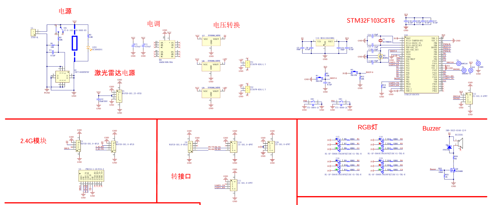

# MCU 二次开发指南

## 硬件说明

STM32 相关硬件连接原理图：



## 工程用途

本工程用于实现机载 MCU 与 LubanCat 之间的串口通信，并根据状态反馈实时控制分电板 RGB 灯。

- 通信链路：UART 双向通信，LubanCat 发状态，MCU 解析后执行动作。
- 灯光控制：RGB 由 GPIO 高低电平直接驱动（非 PWM）。
- 运行环境：STM32F1 + HAL，使用 MDK-ARM（Keil）构建与调试。

## 关键模块

- 串口通信与协议：`Core/Src/usart.c`、`Core/Inc/usart.h`
- RGB GPIO 控制：`Core/Src/gpio.c`、`Core/Inc/gpio.h`
- 主循环与初始化：`Core/Src/main.c`
- 中断处理：`Core/Src/stm32f1xx_it.c`、`Core/Inc/stm32f1xx_it.h`

## 工程目录

- `USART.ioc`：CubeMX 配置。
- `USART.uvprojx` / `USART.uvoptx`：Keil 工程文件。
- `startup_stm32f103xb.s`：启动汇编与向量表。
- `Core/Inc`：头文件目录。
- `Core/Src`：源码目录。
- `Drivers/CMSIS`、`Drivers/STM32F1xx_HAL_Driver`：HAL 与芯片底层驱动。
- `MDK-ARM`、`USART`：构建输出与中间文件。

## 快速开发路径

1. 从 `Core/Src/main.c` 入手，明确初始化与主循环流程。
2. 在 `usart.c` 扩展串口协议，必要时同步更新 `usart.h`。
3. 在 `gpio.c` 实现灯控策略（开关/颜色切换）。
4. 需要事件驱动时，优先使用中断流程（`stm32f1xx_it.c`）。
5. 需要调整底层时钟或 DMA 时，查看 `stm32f1xx_hal_conf.h` 与 HAL 驱动实现。
6. 使用 `STLink` 完成下载与调试。

## 外设驱动要点

### 按键驱动（PA0、PA1）

- 当前有主循环轮询示例。
- 建议改为 EXTI 外部中断，减少漏检和抖动。

```c
void HAL_GPIO_EXTI_Callback(uint16_t GPIO_Pin)
{
    if (GPIO_Pin == GPIO_PIN_0) {
        // 处理 PA0 按键事件
    } else if (GPIO_Pin == GPIO_PIN_1) {
        // 处理 PA1 按键事件
    }
}
```

建议在中断回调中增加 10-50 ms 消抖策略（定时器或时间过滤）。

### 蜂鸣器驱动（TIM3_CH4，约 4kHz）

- `TIM3_CH4` 映射 `PB1`。
- 当前参数：`Prescaler = 72`、`Period = 227`，频率约 4.33 kHz。
- 占空比可设为约 50%（比较值约 114）。

```c
HAL_TIM_PWM_Start(&htim3, TIM_CHANNEL_4);
__HAL_TIM_SET_COMPARE(&htim3, TIM_CHANNEL_4, 114);
```

### 串口驱动（USART1，115200，中断）

- 在 `usart.c` 完成 `huart1` 初始化（8N1，115200）。
- 在 `main.c` 使用 `HAL_UART_Receive_IT` 做单字节中断接收。
- 若有高吞吐需求，建议改 DMA 或环形缓冲区。

## 调试与风险提示

- RGB 通道分散在多组 GPIO，上层逻辑建议集中在 `gpio.c/.h` 维护，避免多处分散改动。
- `TIM4` 仍有 PWM 配置，若后续改为 PWM 调光，注意避免与现有 GPIO 控制冲突。
- 调试蜂鸣器建议用示波器直接查看 `PB1` 波形。

## 烧录故障排查（SWD/JTAG）

当出现 `*** SWD/JTAG Communication Failure ***` 时，按顺序排查：

1. 检查 `PA13/PA14` 是否被其他外设复用。
2. 在 Keil 中将 SWD 下载时钟降到 `100 kHz` 或更低。
3. 必要时进入 Bootloader 模式后再下载。
4. 仍失败时检查 STLink 驱动、焊接与接触质量、芯片是否物理损坏。
